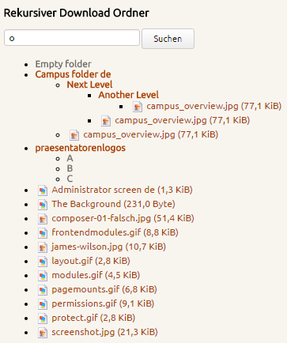
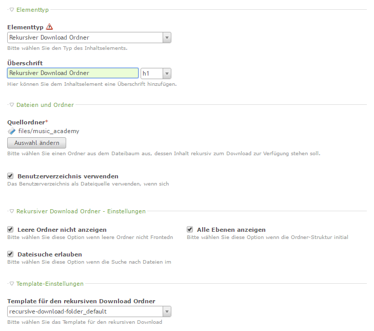

# Contao Extension: hofff.com - Recursive Download Folder

Provides a content element for Contao CMS to define a recursive download folder (display as tree in the front end).

## Features

- select a folder inside Contao `files` or use the user directory (for logged frontend members)
- delivers default CSS and JavaScript (could be customized in templates)
- define a custom template for rendering the levels
- offers an optional file search

## Compatibility

- min. Contao version: ^ 4.9.0

## Installation

Install the extension via composer: [hofff/contao-recursive-download-folder](https://packagist.org/packages/hofff/contao-recursive-download-folder).

## Screenshots

## THANK YOU

- Media Motion AG for the support to upgrade to Contao 5
- U.A.S. Umwelt- und Agrarstudien GmbH for the initial assignment for this extension
- Nina Gerling - ena Webstudio for the support of development and bug fixing
